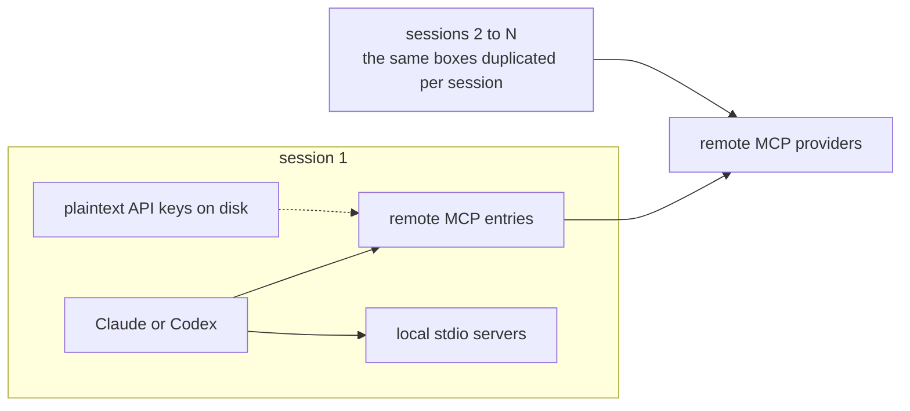
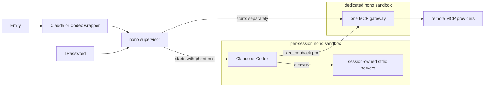

# The MCP subsystem: before and after

## Before

- Claude and Codex connected to remote MCP providers separately.
- Remote MCP credentials lived in local harness configuration, so API keys were duplicated on disk.
- Adding or changing a remote MCP meant updating each harness separately.
- Agent sessions were not consistently launched behind one shared sandbox policy.
- There was no single inventory or activity trail for remote tool calls.



## After

- Claude and Codex are launched through wrappers into separate per-session nono sandboxes.
- Each harness still spawns its own local `stdio` servers. Those child processes stay inside the same sandbox and inherit its grants.
- Both harnesses reach one shared MCP gateway through a narrowly granted loopback port.
- The gateway runs separately under its own nono profile; it does not run inside an agent session.
- The nono supervisor stays outside the sandbox, resolves credentials from 1Password, gives sandboxed processes phantoms, and injects real keys only at egress.
- One registry defines the remote MCPs, and the gateway records a metadata-only activity trail without arguments, results, or secrets.



## Profile layers

```
agent-base                    — shared capabilities, credential routes, and safe defaults for agent harnesses
├── claude                    — normal Claude sessions
│   ├── claude-desktop        — Claude work that needs Desktop access
│   └── claude-mcp-dev        — MCP development with narrow test-port access
├── codex                     — normal Codex sessions
│   └── codex-read-claude     — Codex work that needs read access to Claude files
├── hermes                    — normal Hermes sessions
└── codex-system-audit        — explicit, broader system-audit work

mcp-gateway                  — separate service profile for the gateway; does not inherit agent-base
```
