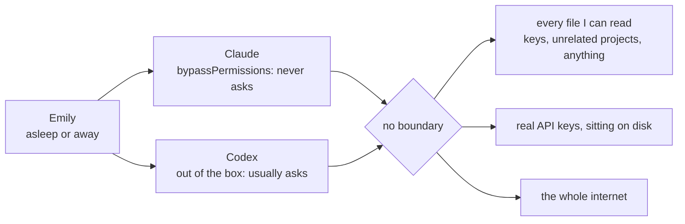
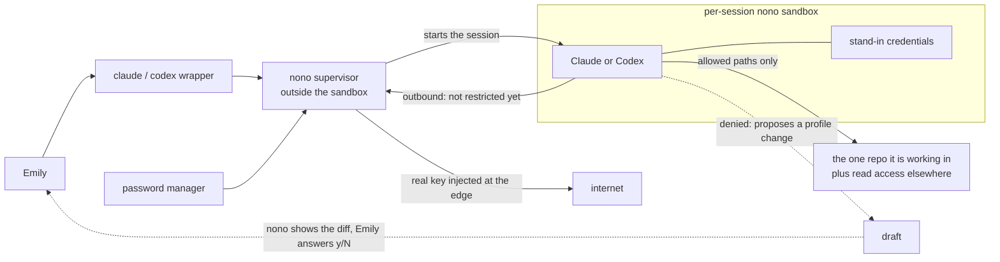

# The nono sandbox: before and after

## Before

I ran Claude in `bypassPermissions` mode — `claude --permission-mode bypassPermissions`. That turns off every permission check. Codex I mostly ran out of the box, so it did stop and ask more often than not.

Approving steps is fine when I'm working alongside AI for an hour. But if I set a task running overnight, I want it to get as far as it can without asking me unnecessary questions. Bypassing permissions was the convenient option and I didn't feel I had time to set up anything better.

So the only thing protecting my machine was hope. The agent ran with exactly the same reach I have. Nothing would have stopped it, and nothing would have told me.

Nothing bad ever happened that I know of. But I can't actually know that — I haven't built observability of tool calls across harnesses, and that's out of scope here.

Two other things were true:

- Claude and Codex each ship their own permission and sandbox machinery, in different shapes. One was bypassed, one was asking. Learning both well enough to trust either is twice the work, and I'd still have no single answer to "what can this thing reach?"

- There was no boundary I could describe in one sentence. If you can't state the rule, you can't check whether it's holding.



## After

Claude and Codex now start inside a sandbox. A wrapper launches them under `nono`, and `nono` decides what that session can touch.

- **One place to look.** Each session runs under a named profile listing which folders it can read and which it can write. One file, not two harnesses' worth of settings.

- **It doesn't get in the way.** The base profile is deliberately permissive: write in the repo I'm working in, read most other places, research normally. If it blocked ordinary work I'd stop using it.

- **Same rules for both harnesses.** This is the claim I'm comfortable making. Not "nothing can go wrong" — Claude and Codex are bound by one thing I wrote and can read.

- **Odd tasks get their own profile.** If something needs wider access I don't disable the sandbox. I make a profile for that job and launch with `claude --nono-profile <name>`.

- **The agent can ask for more, not grant itself more.** A denied session leaves a proposed profile change. On exit the wrapper runs `nono profile promote <name>`, which prints the diff and asks `[y/N]`. I answer that. On `y` it applies and relaunches into the same conversation. On `N` nothing changes.

- **Real secrets stay outside.** The supervisor holding the credentials runs outside the boundary. The agent gets stand-ins; the real key is swapped in as the request leaves. It uses the key without holding it.

- **An escape hatch that looks like one.** `claude-raw` launches with no sandbox. Different name, so it's a decision rather than an accident.



Profile hierarchy: see [the MCP subsystem doc](mcp-subsystem.md#profile-layers).

### Using it

Nothing to remember. I type `claude` or `codex` like always — they're shell functions now, so the sandbox comes along automatically.

```
claude                                 # sandboxed, default profile
codex                                  # same, its own profile
claude --nono-profile claude-mcp-dev   # specific profile
claude-raw                             # no sandbox, deliberate
```

I still run Claude with its own checks bypassed inside the sandbox. I haven't tested how that combination behaves, so I'm not claiming anything about it.

One rough edge: the promote prompt only appears when the session ends. Mid-conversation I open a second terminal and run `nono profile promote <name>` there.

## What this actually fixed

| Question | Answered? |
|---|---|
| Which files can it reach? | **Yes.** This part works. |
| Which sites can it send data to? | **No, not yet.** nono can; I haven't set it up. |
| Does it hold my real keys? | **Half.** It never holds them. Nothing limits what those keys can do. |
| Is this agent allowed to take this action? | **No.** Not addressed. |

An agent in the sandbox still has working access to every service it's connected to. The sandbox stops it reading a file it shouldn't. It doesn't stop it issuing a refund, deleting a cloud document, or pushing code — that isn't the machine acting, it's a service being asked politely by something holding a valid key.

### The network gap

I assumed my sandbox restricted where a session could connect. It doesn't. nono supports it — profiles take allow-lists and deny-lists of domains, enforced through its filtering proxy, and you can pin one tool to one domain. I just never configured it:

```
nono why --profile claude --host pastebin.com     # ALLOWED
```

Every profile I have permits outbound to anything. The only network rules I set were ports. So today this is a filesystem boundary, not a network one. Biggest open item on the list.

An allow-list would help but can't be airtight. The model provider's API has to be on it or the agent can't work, and the agent writes arbitrary text into those requests — anything it can read, it can put in a prompt. Allow `github.com` and a push carries whatever is in the repo. Narrowing domains cuts off the lazy paths. The stronger control is the one I already have: the less it can read, the less there is to leak.

## What it costs to run

| Gave up | Got |
|---|---|
| Occasional denials mid-task | One security model instead of one per harness |
| Tokens and time when the agent retries a blocked route | Something I can read and reason about |
| A few minutes of profile maintenance | Unattended runs that don't depend on hoping |

Too tight and the agent burns turns feeling around for an approved route. Too loose and the boundary stops meaning much. I expect to keep adjusting as I find out where the fence is in the wrong place.

The mental cost went down, which is what I care about — one model in my head instead of one per harness. The cost moved into small interruptions:

| Situation | Roughly |
|---|---|
| Obvious denial, draft is right, I approve it | A couple of minutes |
| I need to read what it's asking and decide where it belongs | 10–20 minutes |
| Something awkward that takes a few rounds | Longer, possibly several passes |

Estimates from using it, not measurements.

One thing to watch: promoting only ever *adds* permissions. Nothing removes them and nothing reminds me to look. Keep saying yes and the profile drifts wider until it isn't a boundary. So maintenance includes re-reading profiles and cutting what I don't need. I haven't set a rhythm for that.

## When I hit a permissions wall

**1. Find out what was refused.** Don't guess from the error:

```
nono why --path /some/path --op write
nono why --host api.example.com
```

Tells me whether it's a file or network thing and which rule decided. Under a minute.

**2. Decide which lever to pull.** The only step needing real thought — how widely does this apply?

| Applies to | Change | Why |
|---|---|---|
| One unusual task | A new profile | Keeps the weird case contained |
| Every session of one harness | `claude` or `codex` | Real for that tool, not all of them |
| Every agent I run | `agent-base` | Most expensive — everything inherits it |
| Nothing about permissions, it just launched wrong | The wrapper script | Don't fix a launch problem with policy |

Default to the narrowest one that works. Easy to widen later, annoying to claw back.

**3. Make the change.** If the draft is asking for the right thing:

```
nono profile promote <name>
```

If I need something more specific:

```
nono profile init my-task --extends agent-base
nono profile validate my-task
```

**4. Check it.** See what it resolves to and exactly what I widened:

```
nono profile show my-task
nono profile diff agent-base my-task
```

**5. Re-run and confirm.**

```
claude --nono-profile my-task
```

Still blocked, back to step 1. Sometimes the answer is I asked for the wrong permission, not too few.

### Adding a new tool later

I haven't built my own agent yet, so this is intent. Try nono first, by default:

```
nono run --profile <name> -- <the tool>
```

But check the seam before writing any wrapper.

## Which tools this works with

A sandbox wraps a program as it starts. So the only question for a new tool is: **is there a moment where something launches the agent that I can get underneath?**

Call it the seam. Starts the agent as a separate program — there's a seam, I can wrap it. Builds the agent in as a library — no separate program, nothing to get underneath. Then the only option is sandboxing the whole application, which is a different boundary covering different things.

| Tool | Seam? | Status |
|---|---|---|
| Claude Code | Yes | Working, used daily |
| Codex | Yes | Working, used daily |
| HumanLayer | One path only | Dropped, see below |
| Hermes | Untested | Profile drafted, never promoted |
| Tools with their own sandbox | Yes, but two sandboxes must nest | Untested |

I'm fine with the gaps. Claude and Codex are most of my sessions, and a control covering the common case beats a plan covering everything that doesn't exist.

### The one that didn't work

I tried bringing HumanLayer into the sandbox and stopped. Running Claude it launches a separate program, so a shim gave me a seam. Running Codex it calls the SDK directly, in its own process — no seam at all.

The boundary would have covered one path and silently not the other. A sandbox with a quiet hole is worse than none, because I'd have believed it. I removed the wrapper.

## What I'd do differently

The lesson isn't about HumanLayer. I built the wrapper before reading how the tool starts things.

Reading for the seam first would have taken an hour and given the same answer. Building first gave me a wrapper, a shim, and a revert. So:

1. **Read for the seam before writing anything.** Where does the tool launch the agent? That one fact predicts whether this can work, and it's cheap to look up.

2. **Try it small, verify automatically.** Checks that pass or fail on their own, not a sense that it seemed fine.

3. **Name what's still unclear.** Some things only settle by using them. Those need human testing, not quiet assumption.

Spend effort only on things that can work, and know which of those I've verified versus merely not seen break.
